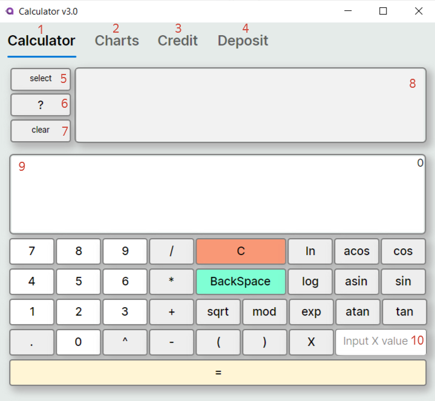
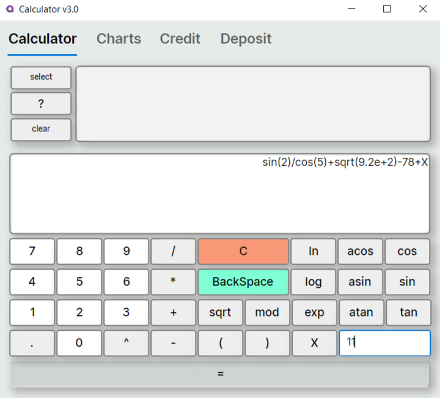
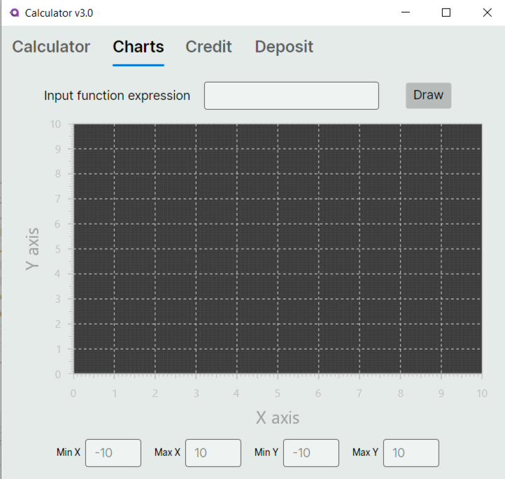
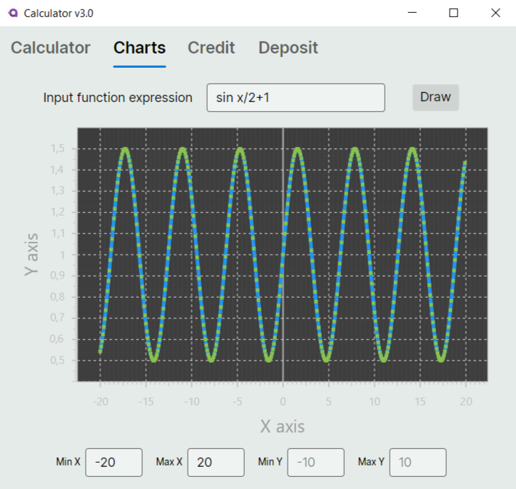

## SmartCalculator

### Интерфейс

1 Вкладка калькулятора

2 Вкладка отображения графиков

3 Вкладка кредитного калькулятора

4 Вкладка депозитного калькулятора

5 Кнопка выбора выражения из окна истории(8)

6 Кнопка вызова мануала

7 Очистка окна истории(8) 

8 Окно истории

9 Окно отображения текущего выражения

10 Окно ввода значения для переменной Х

### Вкладка графики

