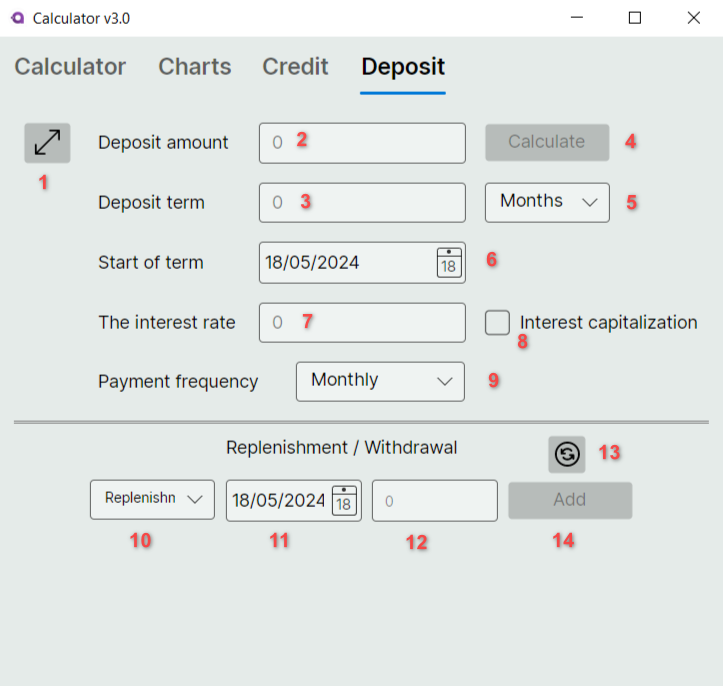

## SmartCalculator

### Установка

Частью проекта является динамическая библиотека на С++ (src/Core/Calculator/CalculatorDll)

**Linux** 

cd src/Calculator

  make ***Запуск***

  make deb ***Сборка установочного deb пакета***

  make install ***Установка***

**Windows/MacOS** 

Компилируем библиотеку (src/Core/Calculator/CalculatorDll). Полученную библиотеку CalculatorDll.* кидаем в папку с исполняемым файлом.

dotnet run

### Интерфейс

<table border="0">
 <tr>
    <td width="550"></td>
    <td width="550">

      
1. Вкладка калькулятора
      
2. Вкладка отображения графиков

3. Вкладка кредитного калькулятора

4. Вкладка депозитного калькулятора

5. Кнопка выбора выражения из окна истории(8)

6. Кнопка вызова мануала

7. Очистка окна истории(8) 

8. Окно истории

9. Окно отображения текущего выражения

10. Окно ввода значения для переменной Х
</td>
 </tr>
 
 <tr>
    <td width="550">
          
    </td>
    <td width="550">
      
* Расчет введенного выражения производится после нажатия кнопки [=]
* Если в расчете используется переменная X необходимо ввести значение для нее в поле (10)
* В окне (8) отображается история последних операций. Чтобы повторить расчет, нужно выбрать интересующую операцию и нажать кнопку select (5).
* При нажатии на кнопку clear (7) происходит очистка истории
* Кнопка ? (6) вызывает текущее руководство
    </td>
 </tr>

 <tr>
    <td width="550">
          
    </td>
    <td/>
 </tr>
</table>

### Графики
<table>
 <tr>
    <td width="550">
          
    </td>
    <td width="550">
      
1. Окно ввода выражения функции
2. Кнопка отрисовки графика функции
3. Окно отрисовки графика функции
4. Минимальное отображаемое значение по оси X
5. Максимальное отображаемое значение по оси X
6. Минимальное отображаемое значение по оси Y
7. Максимальное отображаемое значение по оси Y
    </td> 
 </tr>

  <tr>
    <td width="550">
          
    </td>
    <td width="550">
      
* По умолчанию диапазон по осям от -10 до 10
    </td> 
 </tr>
</table>

### Кредитный калькулятор
<table>
 <tr>
    <td width="550">
          
    </td>
    <td width="550">
      
1. Окно ввода суммы кредита
2. Окно ввода длительности кредита
3. Окно ввода ставки кредита
4. Кнопка расчета кредита
5. Выбор единицы измерения длительности кредита
6. Выбор кредита с аннуитетными платежами
7. Выбор кредита с дифференцированными платежами
8. Кнопка перехода к окну* с результатами расчета

*открывается автоматически при нажатии кнопки расчета(4)
    </td> 
 </tr>

  <tr>
    <td width="550">
          
    </td>
    <td width="550">
      
* Максимальная сумма кредита ограничена 1 000 000 000=
* Доступные единицы времени длительности кредита (Месяц/Год)
* Максимальная длительность ограничена:
  
       если выбран Месяц - 600,
  
       если выбран Год - 50
* Максимальная ставка ограничена числом 999
    </td> 
 </tr>

   <tr>
    <td width="550">
          
    </td>
    <td width="550">
      
1. Кнопка возврата в главное окно кредитного калькулятора
2. Ежемесячные платежи

      если выбраны аннуитетные платежи - значение,
   
      если выбраны дифференцированные платежи - диапазон значений от начального до конечного расчетного периода
   
4. Сумма начисленных процентов
5. Сумма кредита + начисленные проценты
6. Столбец с номером расчетного периода по порядку
7. Столбец расчетного периода
8. Ежемесячный платеж по кредиту
9. Ежемесячный платеж по телу кредита
10. Ежемесячный платеж по процентам
11. Остаток кредита
    </td> 
 </tr>
</table>

### Депозитный калькулятор
<table>
 <tr>
    <td width="550">
          
    </td>
    <td width="550">
      
1. Кнопка перехода к окну* с результатами расчета
2. Окно ввода суммы депозита
3. Окно ввода длительности депозита
4. Кнопка расчета депозита
5. Выбор единицы измерения длительности депозита
6. Окно выбора начала депозита
7. Окно ввода ставки депозита
8. Чекбокс будет ли депозит с капитализацией процентов
9. Выбор периодичности выплат процентов
10. Выбор пополнения/снятия депозита
11. Выбор даты пополнения/снятия депозита
12. Выбор суммы пополнения/снятия депозита
13. Кнопка сброса выбранных пополнений/снятий депозита
14. Кнопка добавления пополнения/снятия депозита

*открывается автоматически при нажатии кнопки расчета(4)
    </td> 
 </tr>

  <tr>
    <td width="550">
          
    </td>
    <td width="550">
      
* Максимальная сумма депозита ограничена 1 000 000 000=
* Доступные единицы времени длительности депозита (День/Месяц/Год)
* Максимальная длительность ограничена:

      если выбран День - 18250,

      если выбран Месяц - 600,
  
      если выбран Год - 50
  
* Максимальная ставка ограничена числом 999
* Доступная периодичность выплат процентов:

      В конце срока
  
      Ежедневно
  
      Раз в неделю
  
      Раз в месяц
  
      Раз в квартал
  
      Раз в полгода
  
      Раз в год
  
    </td> 
 </tr>

   <tr>
    <td width="550">
          
    </td>
    <td width="550">
      
1. Кнопка возврата в главное окно депозитного калькулятора
2. Сумма начисленных процентов
3. Баланс депозита на конец вклада
4. Сумма начисленных налогов
5. Дата (расчетный период, снятие/пополнение депозита)
6. Начисленные проценты за расчетный
7. Изменение баланса депозита (Снятие/капитализация процентов, снятие/пополнение депозита)
8. Баланс депозита на указанную дату
 
    </td> 
 </tr>
</table>
